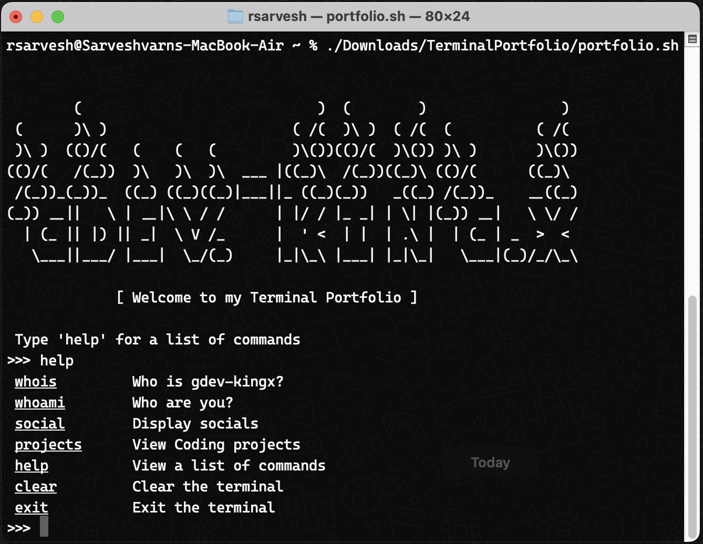

# Terminal Portfolio

- This Project is created to learn shell script in Mac
- Also, This is my Portfolio (Amature Version)

To run this Project
1. Open any bash terminal
2. cd to the project directory
3. Run the following commands

```
$ chmod +x portfolio.sh

$ ./portfolio.sh
```

## Output
[](./Output.mp4)
